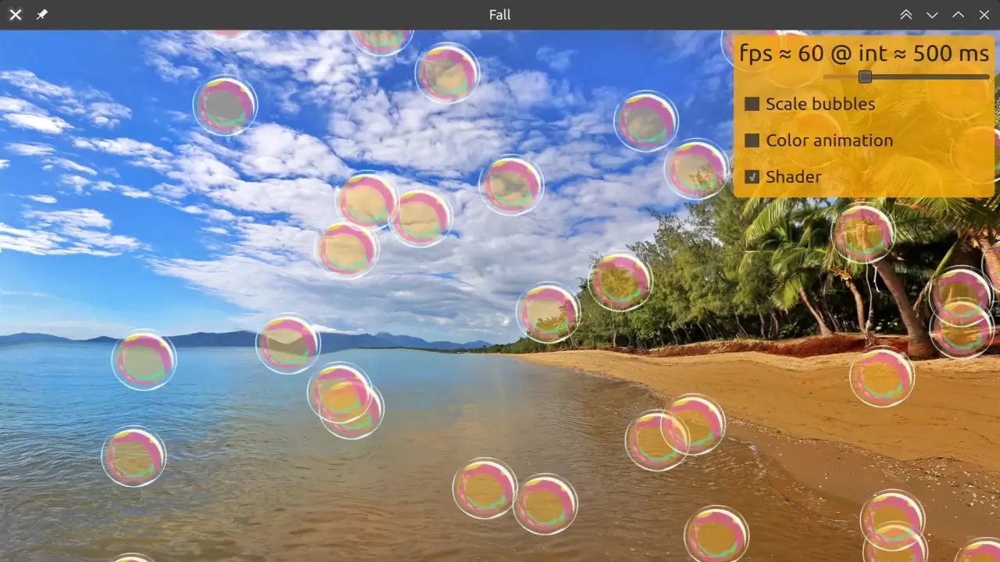

# Fall

Fall is a simple benchmark app to test Qt Quick animations. It supports Qt versions > 5.12, including Qt 6 (tested up to 6.4.2).



## Features

```
Usage: ./Fall [options]
Fall

Options:
  -h, --help  Displays help on commandline options.
  --help-all  Displays help including Qt specific options.
  -b <type>   Background type: image,qtvideo
  -p <path>   Media path
```

The available options for the background are:
* image: an embedded static image is shown;
* qtvideo: a video is decoded though regular Qt backends and rendered as the background (use the -p param to set the path to the video);
* potvl: a video decoded and rendered through PiOmxTextures (only for Raspberry Pi, https://github.com/carlonluca/pot).